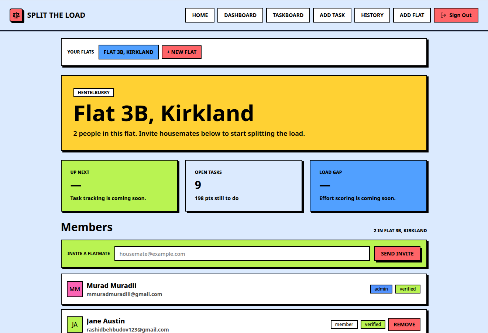
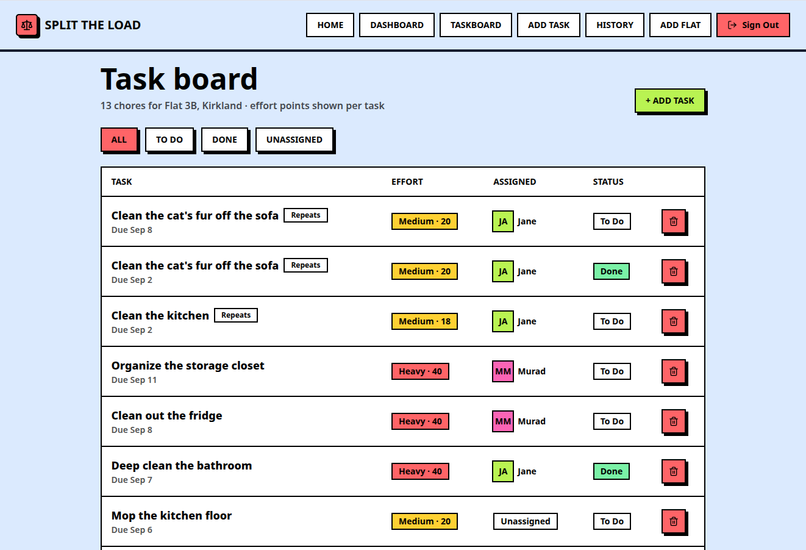
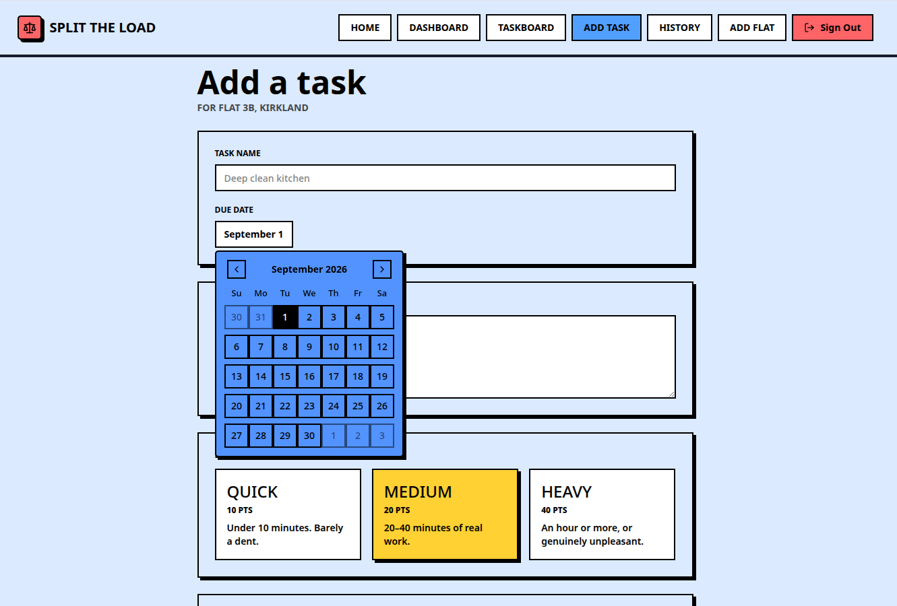
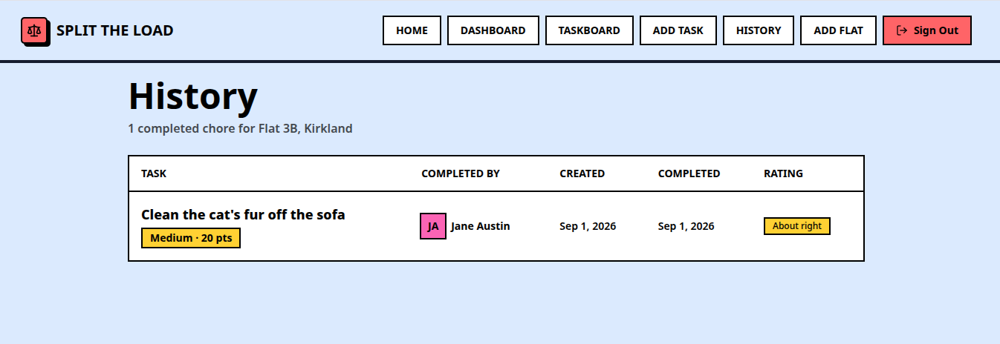

# Split the Load

Chores aren't equal. Scrubbing the bathroom and taking out the trash both count as "one task" on most chore apps, which is how you end up with one flatmate quietly doing twice the work. Split the Load scores every chore by effort instead of just checking it off a list, so a flat can actually agree on who's carrying their weight.

Built it for my own flat, mostly. Sharing it in case it's useful to yours too.

## Try it

Live at [splittheload.vercel.app](https://splittheload.vercel.app) — sign in with a demo account instead of creating your own:

```
email:    demo@splittheload.app
password: Demo1234!
```

It's a shared account with a seeded flat ("The Demo Flat"), a couple of fake housemates, and a mix of tasks (some done, some not, a couple recurring) so there's actually something to look at. It's fully mutable — feel free to poke at it, rename things, delete stuff. There's nothing paid or sensitive behind it, so don't worry about breaking anything; just know that whatever the last person did is what you'll see.



## What it does

- **Flats & invites** — create a flat, invite housemates by email, they click a link and join. No accounts to set up manually.
- **Effort-scored tasks** — every chore is tagged Quick, Medium, or Heavy, each worth a starting number of points. Assign it to someone directly, or let it auto-assign to whoever's currently carrying the least.
- **Recurring chores that self-correct** — mark a repeating task "harder" or "easier" than expected when you finish it, and its score nudges itself (10% at a time) toward reality over the next few times it comes around, instead of staying wrong forever.
- **A real history** — every completed chore is logged with who did it, when it was created, when it was finished, and what it was worth at the time — so the record doesn't silently change when a recurring task's score drifts later.

## Screenshots

| Task board                           | Add a task                         |
| ------------------------------------ | ---------------------------------- |
|  |  |



## Stack

- [Next.js](https://nextjs.org) (App Router) + TypeScript
- [Drizzle ORM](https://orm.drizzle.team) on Postgres ([Neon](https://neon.tech))
- [better-auth](https://www.better-auth.com) for email/password auth + email verification
- [Brevo](https://www.brevo.com) for transactional email (invites, password resets)
- Tailwind CSS + a neobrutalist shadcn/radix component set.

## Running it locally

You'll need a Postgres database (Neon works well, but any Postgres will do) and a [Brevo](https://www.brevo.com) account for sending email.

```bash
pnpm install
```

Copy `.env.example` to `.env` (or just create `.env`) and fill in:

```bash
DATABASE_URL=
BETTER_AUTH_SECRET=      # any long random string
BETTER_AUTH_URL=http://localhost:3000
BREVO_API_KEY=
EMAIL_FROM=
```

Push the schema to your database:

```bash
pnpm drizzle-kit migrate
```

Then start the dev server:

```bash
pnpm dev
```

Open [http://localhost:3000](http://localhost:3000).

## Project layout

The short version, if you're poking around:

- `app/` — routes. Mostly self-explanatory: `dashboard`, `taskboard`, `add-task`, `history`, `flats/new`, `invite/[token]`, `members/[membershipId]`.
- `lib/flats.ts` / `lib/tasks.ts` — the actual business logic (creating flats, invites, tasks, completions, the effort-drift algorithm). The `app/*/actions.ts` files are thin wrappers around these for use as server actions.
- `lib/db/schema.ts` — the Drizzle schema; `drizzle/` has the generated migrations.
- `components/ui/` — the design system components.

## A couple of honest caveats

- No mobile app, it's just a responsive web app.
- The effort-drift algorithm is deliberately simple (a fixed 10% nudge per rating) — no fuzzy matching, no duplicate-task detection, nothing fancy. It does the one job it's meant to do.
